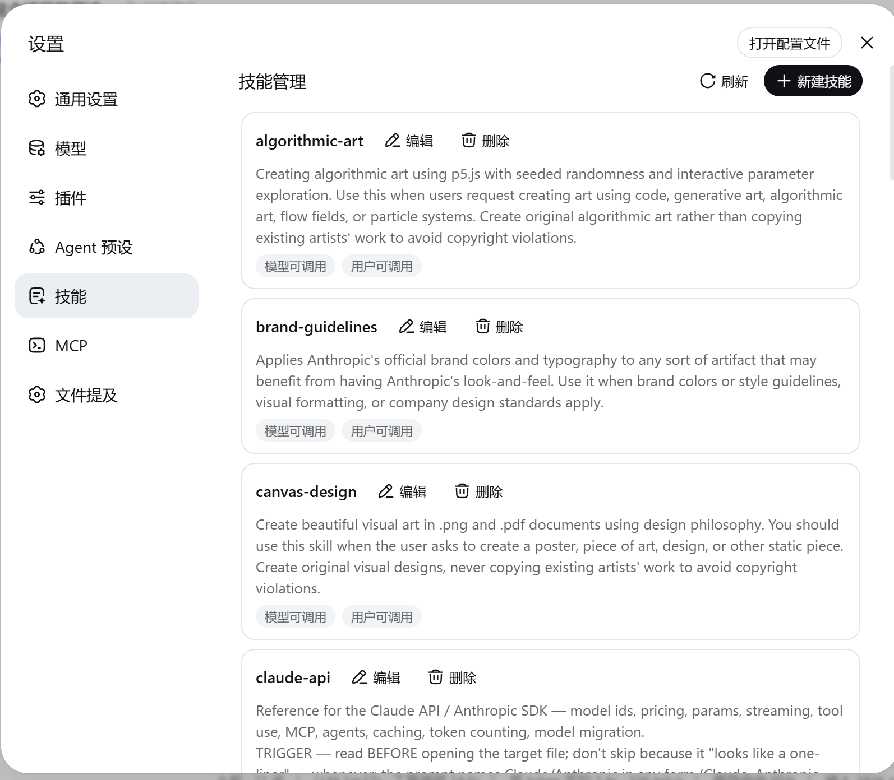
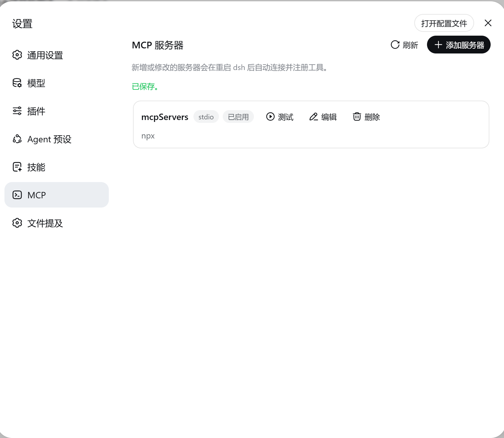

# dsh-manage-hub

一个 [DeepSeek Harness](https://github.com/deepseek-ai/deepseek-harness) 插件，在网页设置面板中新增两个管理页面：

- **Skills** — 浏览、导入、删除、开关用户自有技能（存放于 `$DSH_HOME/skills`）。
- **MCP** — 管理 MCP 服务器配置（stdio / Streamable HTTP），支持增删改与连接测试。启用的服务器写入当前 profile 的 `cordis.patch.yml`，重启后自动连接，工具注册为 `mcp__<server>__<tool>`。

## 截图

**Skills 页面**



**MCP 页面**



## 安装

要求：已安装带 web profile 的 dsh，且 `PATH` 中有 `pnpm`。

从 GitHub 安装：

```sh
dsh plugin --profile web add https://github.com/Lrxc/dsh-manage-hub.git
```

或从本地目录：

```sh
git clone https://github.com/Lrxc/dsh-manage-hub.git
dsh plugin --profile web add file:./dsh-manage-hub
```

重启：

```sh
dsh --profile web
```

`dsh plugin` 会在 profile 目录执行 `pnpm add`，并自动把包加入 `dsh.profile.bundles`（因为本包声明了 `dsh.bundle` 补丁），无需手动改补丁。

> 若此前对 `dsh-host-apiproxy`、`dsh-client-connection`、`dsh-client-ui-settings-general` 做过手动补丁，请先回退，否则设置面板会出现重复的 Skills/MCP 区块。

## 结构

| 模块 | 位置 |
| ---- | ---- |
| 主机插件 | `lib/index.js` — `/dsh-manage` 下的 HTTP JSON 路由 |
| 浏览器插件 | `lib/client.js` — 通过 `fetch` 实现的设置区块 |
| Profile 层 | `cordis.patch.yml`（经 `dsh.bundle.patch` 声明） |
| 技能存储 | `$DSH_HOME/skills/<name>/SKILL.md` |
| MCP 配置存储 | `$DSH_HOME/mcp-servers.yaml` |
| MCP 激活 | 在 profile 的 `cordis.patch.yml` 中生成 `mcp-*` 行 |

主机端依赖 `yaml`、`@modelcontextprotocol/sdk` 与 `fflate`（均已内置在 dsh 中）；浏览器端为手写的 `window.__ModuleLoader__` bundle，无需构建。

## 卸载

```sh
dsh plugin --profile web remove dsh-manage-hub
```

如不再需要，删除 profile `cordis.patch.yml` 中生成的 `mcp-*` 行及 `$DSH_HOME/mcp-servers.yaml`。

## License

MIT
